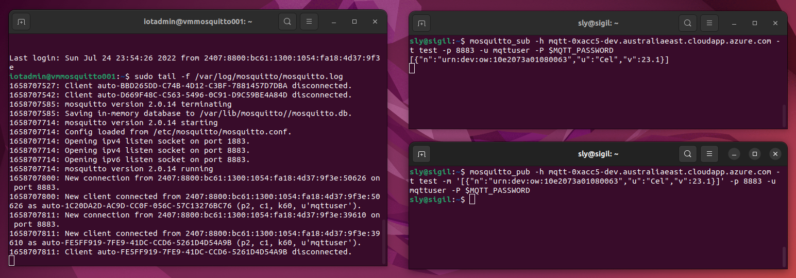

Mosquitto server on Azure
=========================

Server is running dual-stack, with the primary access via IPv6, however Azure also needs IPv4 for management access.

The server uses Certbot to acquire an SSL certificate from LetsEncrypt (with automatic renewal), and then configures Mosquitto to
use that certificate. Mosquitto also has anonymous access turned off, so you must use the supplied password.

The server is configured to automatically shutdown at 19:00+10 (Brisbane time) each night, to save costs if you are running it
in a limited developer subscription. You can adjust this for your timezone.

Requirements:
* PowerShell
* Azure CLI

To deploy, login to Azure CLI, and then run the deployment script. Setting a password is required, with other values set to
reasonable defaults (for Australia, where I am based; you may want to change location).

```powershell
az login
az account set --subscription 'acc54a93-d63e-4462-953e-dbeba4387b12'
$VerbosePreference = 'Continue'
./deploy-mosquitto.ps1 YourSecretPassword
```

The public adddresses of the machine are given a unique name, using the subscription prefix by default (but you can use a different OrgId if you want).

After deployment, the fully qualified domain name (fqdns) is shown, and can be used to access the MQTT server using an MQTT client, with the username 'mqttuser' and the password you specified when running the script.

The script also creates additional users 'mqttsystem', 'mqttdevice1', and 'mqttdevice2', with the password you specified with the suffix '2', '3', or '4', repectively.

Testing the Mosquitto server
----------------------------

You can the Mosquitto tools to test the server, https://mosquitto.org/

Or use an online utility like Paho https://www.eclipse.org/paho/index.php?page=clients/js/utility/index.php.

Install if needed, e.g. on Linux:

```shell
snap install mosquitto-clients
```

### Running the test clients

First, in one terminal, subscribe:

```shell
export MQTT_PASSWORD=YourSecretPassword
mosquitto_sub -h mqtt001-0xacc5-dev.australiaeast.cloudapp.azure.com -t test -p 8883 -u mqttuser -P $MQTT_PASSWORD
```

Then use another terminal to publish a message (note that mqttdevice1 has the password suffix '3'):

```shell
export MQTT_DEVICE1_PASSWORD=YourSecretPassword3
mosquitto_pub -h mqtt001-0xacc5-dev.australiaeast.cloudapp.azure.com -t test -m '[{"n":"urn:dev:ow:10e2073a01080063","u":"Cel","v":23.1}]' -p 8883 -u mqttdevice1 -P $MQTT_DEVICE1_PASSWORD
```

Example output (also showing the log tail on the server):




Server management
-----------------

### SSH access

You can also SSH into the server, to check the application (the script automatically assigns your local SSH key with access):

```
ssh iotadmin@mqtt001-0xacc5-dev.australiaeast.cloudapp.azure.com
```

You can then follow the Mosquitto logs with:

```
sudo tail -f /var/log/mosquitto/mosquitto.log
```

### Stop and start

There are scripts to stop (to save money) and restart (e.g. each day after the automatic shutdown) the server.

```powershell
./stop-mosquitto.ps1
./start-mosquitto.ps1
```

After restarting you need to log on and run the Leshan server (`java -jar ~/leshan-server/leshan-server-demo.jar`)

### Cleanup

When you are finished, you can remove the resource group, which removes the server, network, IP addresses, and other Azure resources
that were deployed.

```powershell
./remove-mosquitto.ps1
```

### IPv4

If you do not have IPv6 available, then there is also an IPv4 endpoint:

```shell
mosquitto_sub -h mqtt001-0xacc5-dev-ipv4.australiaeast.cloudapp.azure.com -t test -p 8883 -u mqttuser -P YourSecretPassword
```

Insecure server
---------------

Some devices are not capable of MQTTS (TLS) connections; they only support insecure connections.

To safely deploy such devices, you can use private networks -- and for NB-IoT devices a private APN (Access Point Name) -- to make them secure.

In those case you may want to test with an insecure MQTT server that does allow connection on port 1883.

The script allows you create additional servers (e.g. number 002), and configure them to allow insecure access.

```powershell
az login
$VerbosePreference = 'Continue'
./deploy-mosquitto.ps1 -MqttPassword YourInsecurePassword -ServerNumber 2 -AllowInsecure
```

To test your connection:

```shell
export MQTT_PASSWORD=YourInsecurePassword
mosquitto_sub -h mqtt002-0xacc5-dev.australiaeast.cloudapp.azure.com -t test -p 1883 -u mqttuser -P $MQTT_PASSWORD
```

And then send:

```shell
export MQTT_DEVICE_PASSWORD=YourInsecurePassword3
mosquitto_pub -h mqtt002-0xacc5-dev.australiaeast.cloudapp.azure.com -t test -m "Insecure" -p 1883 -u mqttdevice1 -P $MQTT_DEVICE_PASSWORD
```


Troubleshooting
---------------

Connect (SSH) to the server and check the cloud init logs:

```shell
more /var/log/cloud-init-output.log
```

Also see: https://docs.microsoft.com/en-us/azure/virtual-machines/linux/cloud-init-troubleshooting

Test if Mosquitto is working on the server, e.g

```shell
sudo systemctl status mosquitto
sudo tail /var/log/mosquitto/mosquitto.log
mosquitto_pub -h localhost -t test -m "hello world" -u mqttuser -P YourSecretPassword
```

From a client you can also test if you can connect to the port, and if SSL is working.

```shell
nc -vz mqtt001-0xacc5-dev.australiaeast.cloudapp.azure.com 8883
echo "Q" | openssl s_client -showcerts mqtt001-0xacc5-dev.australiaeast.cloudapp.azure.com:8883
```


References
----------

* https://www.digitalocean.com/community/tutorials/how-to-install-and-secure-the-mosquitto-mqtt-messaging-broker-on-ubuntu-18-04-quickstart
* https://github.com/eclipse/mosquitto/blob/master/README-letsencrypt.md


Todo
----

* Have a look at Eclipse Streamsheets (could install on Mqtt server): https://github.com/eclipse/streamsheets
